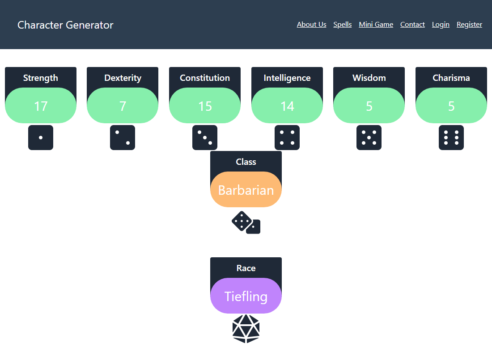

# Dungeons & Dragons - Character Generator
  

## 1. Table of Contents:
This readme file includes the following contents:
+ [Description](#2-description)
+ [Installation](#3-installation)
+ [Usage](#4-usage)
+ [License](#5-license)
+ [Application results](#6-application-results)
+ [Questions](#7-questions)

## 2. Description: 
This is an Dungeons and Dragons (DnD) character creation web application. This is a simplified web application of DnD character sheet.

Step into a world of infinite possibilities with our Dungeons and Dragons character generator! Create your very own character hero using this character generator. Be able to determine your stats such as strength, dexterity, intelligence and many more. Find out what class and race your character will become. From cunning sorcerers to battle ready fighters, you can create the perfect character to suit your playstyle.

So go find out what your character will become! Be smart and fight well!

## 3. Installation:
Please make sure to have following programs installed on your computer to use this app:
+ VS Code
+ GitBash
+ Node.js
+ React
+ Tailwind Css

To use this program, `git clone` the repo down to your local. Then, run `npm install` in order to install the `npm` package dependencies as specified in the `./package.json`. Now, you are ready to go!

## 4. Usage:
To use this application, follow the instruction below: 
+ `npm install` - this will install the required `npm` packages.
+ `npm run seed` - this will seed initial db data. 
+ `npm run build` - this will build the application.
+ `npm run start` - this will start this application.
+ `npm run develop` - this is an option for developer. So, if you want to test/update the source, use this instead.

## 5. License:
### The MIT License
  

## 6. Application results:
[GitHub:] https://github.com/KobyS82/character-generator 
[Vercel:] https://character-generator-tawny.vercel.app/ 
The screenshot of the application looks like this: `./assets/Screenshot.png` -  

## 7. Questions?:
If you have any questions, feel free to contact one of the developers via information below: 
Koby Sillito - KSillitoWork@gmail.com  
Joseph Bullock-Palser - PhillipVector@gmail.com  
Jesus Perez - perez.jesus1039@gmail.com  
Sean Yanez - sdby2003@gmail.com  
Caleb Davidson - calebgdavidsonn@gmail.com  
Jungwoo Lee - jungwoo33@gmail.com  

- - -
© 2023 Koby, Joseph, Jesus, Sean, Caleb, and Jungwoo, Confidential and Proprietary. All Rights Reserved.
